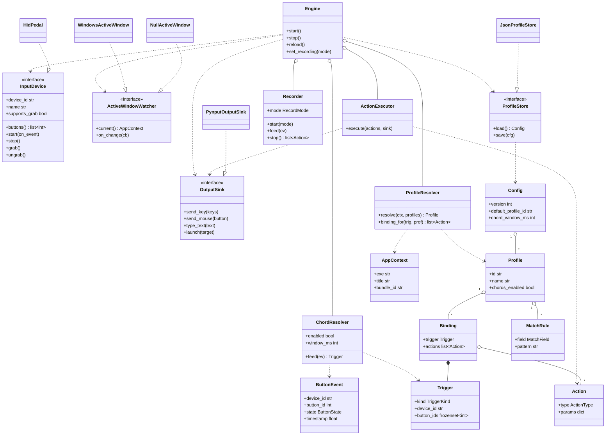

# Architecture

Foot pedal remapper. A headless, event-driven engine with a detachable GUI. This
document is the structural reference: the class model, the runtime pipeline, and
the rules that keep the layers decoupled.

## Two invariants

1. **Data flows one direction.** Device to chord resolver to profile resolver to
   action executor. No stage calls back upstream or sideways.
2. **IDs are hardware-agnostic past the device layer.** The device layer owns the
   only translation from raw report bytes to a logical `button_id`. Everything
   downstream deals in plain IDs and value objects.

The structure is hexagonal (ports and adapters). The core defines interfaces
(ports); OS-specific and hardware-specific code are adapters that implement them.
The dependency rule is absolute: `core` imports nothing from `devices`,
`platform`, `persistence`, or `gui`.

## Class model (UML)

Render this on GitHub, in VS Code with a Mermaid preview extension, or at
mermaid.live.



## Roles by group

### Ports (interfaces, defined in core, no implementation)

- `InputDevice`: a controller with buttons. Discovers itself, reports its button
  set, and pushes `ButtonEvent`s through a callback. `supports_grab` plus
  `grab`/`ungrab` exist for keyboard-emulating devices that must be captured
  exclusively so their own keystrokes do not leak through. Raw-HID pedals return
  `supports_grab = False`.
- `OutputSink`: synthesizes keystrokes, mouse actions, text, and process launches.
  The action executor talks only to this, never to `pynput` directly.
- `ActiveWindowWatcher`: reports the focused application as an `AppContext`. Has a
  null implementation so the whole system runs with app-detection turned off.
- `ProfileStore`: loads and saves the whole `Config`.

### Core (pure logic, no OS calls)

- `Engine`: wires the stages, owns the event loop, holds the active device(s) and
  current profile. The only object the GUI talks to.
- `ChordResolver`: buffers near-simultaneous presses within `window_ms` and emits
  a single `Trigger`. When disabled, each `ButtonEvent` passes straight through as
  a single-button `Trigger`.
- `ProfileResolver`: a pure function. Given an `AppContext` and the set of
  profiles, returns the active `Profile`; given a `Trigger` and a `Profile`,
  returns the bound actions. No side effects, trivially unit-testable.
- `ActionExecutor`: runs an ordered `Action` list against an `OutputSink`.
- `Recorder`: capture-mode state machine. Diverts input into an action buffer
  instead of the executor.

### Domain value types

- `ButtonEvent`, `Trigger`, `Action`, `Binding`, `MatchRule`, `Profile`,
  `AppContext`, `Config`. `Trigger` is hashable (frozen) so it can key a binding
  lookup. A `Binding` holds an ordered list of `Action`s, which is what makes
  "map to one or more keys", macros, and recorded sequences the same thing.

### Adapters (implement the ports)

- `HidPedal` implements `InputDevice` via hidapi (v1 target: raw HID reads).
- `PynputOutputSink` implements `OutputSink`.
- `WindowsActiveWindow` and `NullActiveWindow` implement `ActiveWindowWatcher`.
- `JsonProfileStore` implements `ProfileStore`.

## Runtime pipeline

```
InputDevice --ButtonEvent--> ChordResolver --Trigger--> ProfileResolver --Actions--> ActionExecutor --> OutputSink
                                                             ^
                                          AppContext (ActiveWindowWatcher)
                                          Profiles (ProfileStore)
```

A chord, once resolved, is indistinguishable from a single button downstream:
both are just a `Trigger`. Profile selection is invisible to everything after the
resolver. Those two facts are why chords and app-detection do not leak into the
rest of the code.

## Recording is a mode, not a stage

When recording, the `Engine` puts the `ActionExecutor` to sleep and routes
captured keyboard and mouse input into the `Recorder`'s buffer. This prevents the
recorded keys from firing mappings or landing in the focused window. The two
capture modes are the same buffer with a different stop condition: `AUTO` stops on
a short idle timeout or after N events; `EXPLICIT` stops on the user pressing
stop.

## Concurrency

- Device read loop: its own thread, blocking on hid reads, pushing events onto a
  queue.
- Engine worker: drains the queue, runs the chord resolver (which may hold a press
  for `window_ms` via a deadline), resolves the profile, executes actions.
- Active window watcher: a polling thread (a few hundred ms) that updates the
  current `AppContext` under a lock.
- GUI: Tkinter on the main thread. Tkinter is not thread-safe, so any update from
  another thread must be marshaled with `widget.after(...)`.

Shared `Config` access is guarded by a lock. Reloads swap the config atomically so
a press mid-reload never sees a half-applied state.

See `design.md` for requirements, the persistence schema, and open risks.
